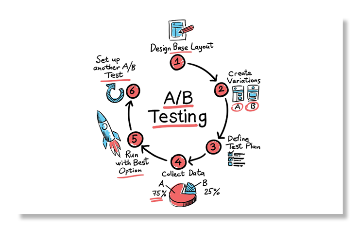
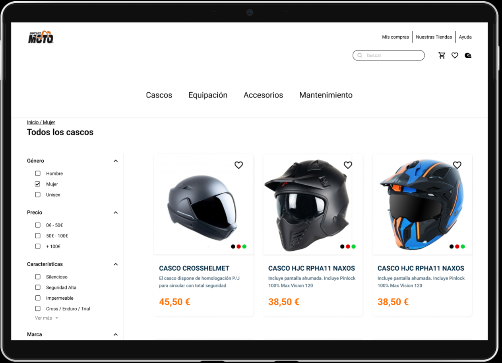
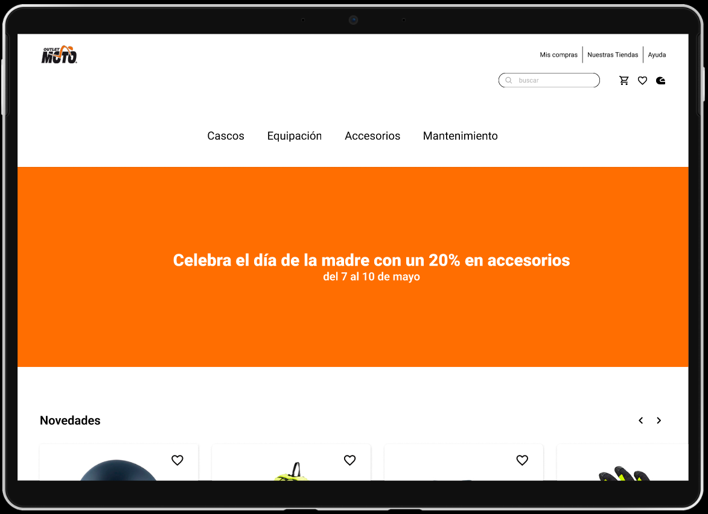
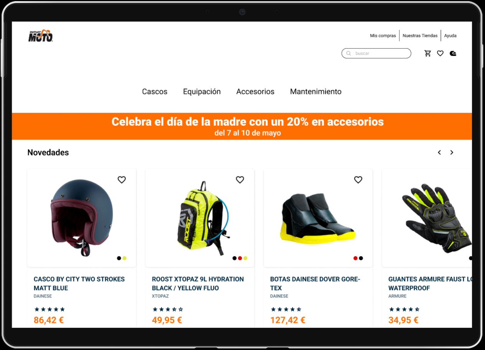
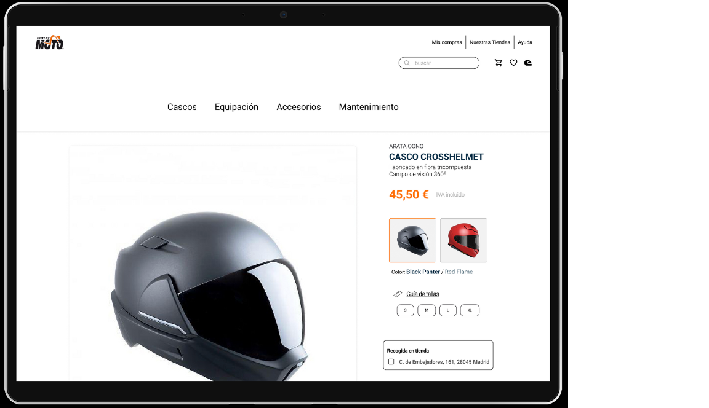
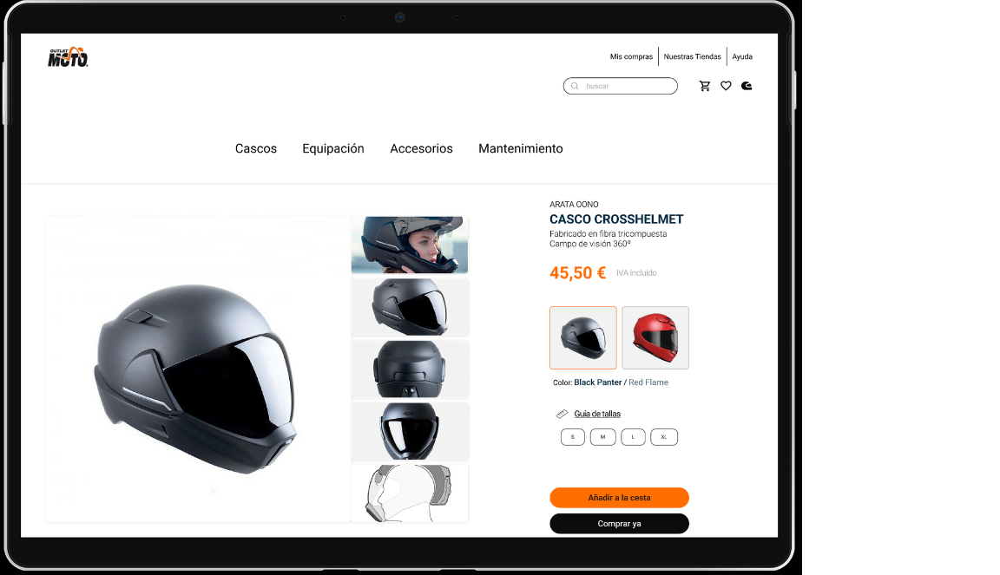
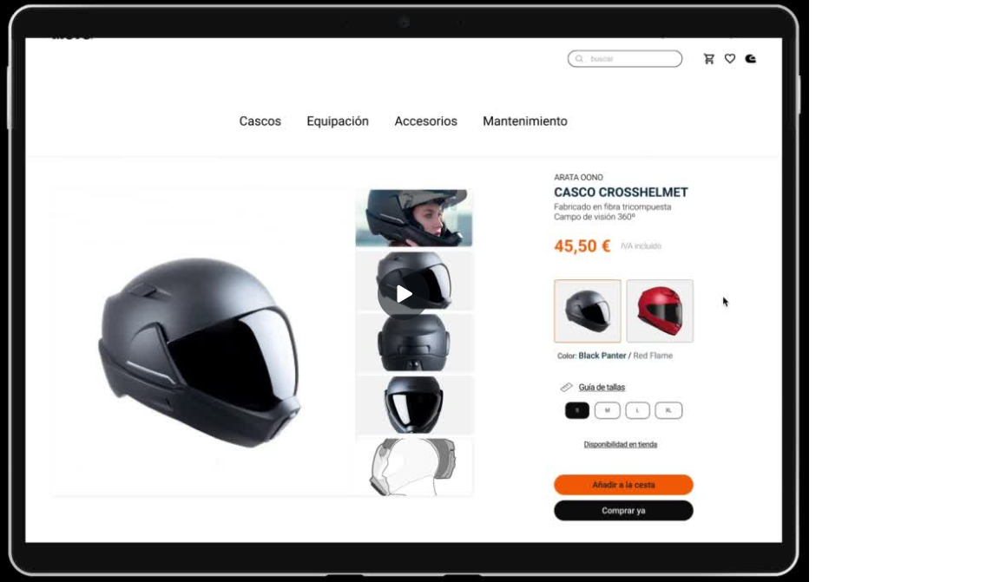
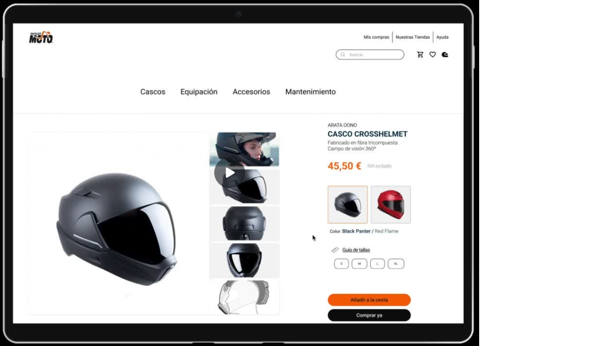

# IRONHACK CRO

## Proyecto CRO con UX/UI
### Grupo Alonso Martínez



## Índice

1. [⚙️ Descripción](#descripcion-del-proyecto)
2. [🏁 Objetivo](#objetivo)
3. [📱 Prototipo](#prototipo)
3. [🕶️ Análisis](#analisis)
4. [🏍️ Conclusiones](#conclusion)
5. [⛓️ Estructura](#estructura)


## ⚙️ Descripción:<a name="descripción"/>

Proyecto CRO como Data Analyst en Ironhack colaborativo con UX/UI.

Se plantea el análisis de un prototipo web de venta de artículos de motos. El resto se basaba en completarlo en cinco horas.

El prototipo fue realizado y actualizado por las compañeras de UX/UI mientras que desde Data Analysis nos encargamos de realizar el análisis por AB testing.

El objetivo para la web es comprar un casco de mujer, con un coste menor de 50 euros y con recogida en tienda.

Para poder ver la presentación, dejamos el link a continuación:

- [Presentación CRO](https://www.canva.com/design/DAFjW44TA0g/xvawfLiiqA2kN5cEwFK5bw/edit?utm_content=DAFjW44TA0g&utm_campaign=designshare&utm_medium=link2&utm_source=sharebutton)

## 🏁 Objetivo:<a name="objetivo"/>

El proyecto se divide en dos ojetivos:

- Mejorar el prototipo de web.
- Cuantificar la mejora.

## 📱 Prototipo:<a name="prototipo"/>

Como tareas principales de mejora se han priorizado las siguientes:


<details>
<summary>Buscador:</summary>
<br>

Se ha añadido el acceso al buscador para facilitar la navegación al usuario ya que se detectó en la recogida que había casos de gente optaba por esa opción.



</details>

<details>
<summary> Banner:</summary>
<br>


En un origen el banner tenía un tamaño que no permitía la visión de los artículos de primera mano sino que había que scrollear para poder encontrarlos. Este tamaño se ha reducido y adaptado.




</details>

<details>
<summary> Página de producto:</summary>
<br>

Se ha hecho más pequeño el card para mejorar la vista y el acceso al resto de fotos.




</details>


<details>
<summary> Disponibilidad en tienda:</summary>
<br>

Se cambió el botón por uno más visible así como la no obligatoriedad de clicarlo antes de hacer la compra. Se puede elegir la búsqueda de la tienda y marca si está disponible o no y se puede escoger en el carrito al efectuar la compra.




</details>

## 🕶️ Análisis:<a name="analisis"/>

Para la parte de análisis se ha observado una muestra de 60 personas, 30 de la parte control y 30 de la parte tratamiento. Estas encuestas se han realizado de manera directa viendo cómo interactúan con la página.

Las medidas que hemos recogido son:

- Tiempo que se tarda en finalizar el proceso.
- Número de clicks realizados en total.
- Frustración durante la compra.

A partir de esta contabilización hemos realizado un análisis de ello a través de la técnica de AB Testing.


## 🏍️ Conclusiones:<a name='conclusion'/>


## ⛓️ Estructura:<a name="estructura"/>

```
Proyecto 
|__ DATA/                         # contiene los csv limpios
|
|__ IMAGES/                       # imagénes referentes al proyecto    
|
|___JUPYTER/                      # notebooks y archivos python con el análisis
|
|__ .gitignore                    # archivo gitignore     
|
|__ README.md                     # información del proyecto
```